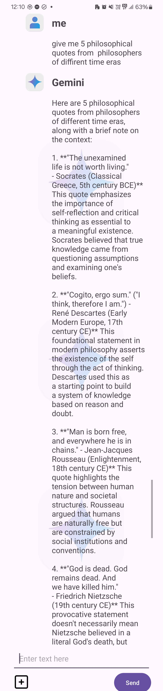
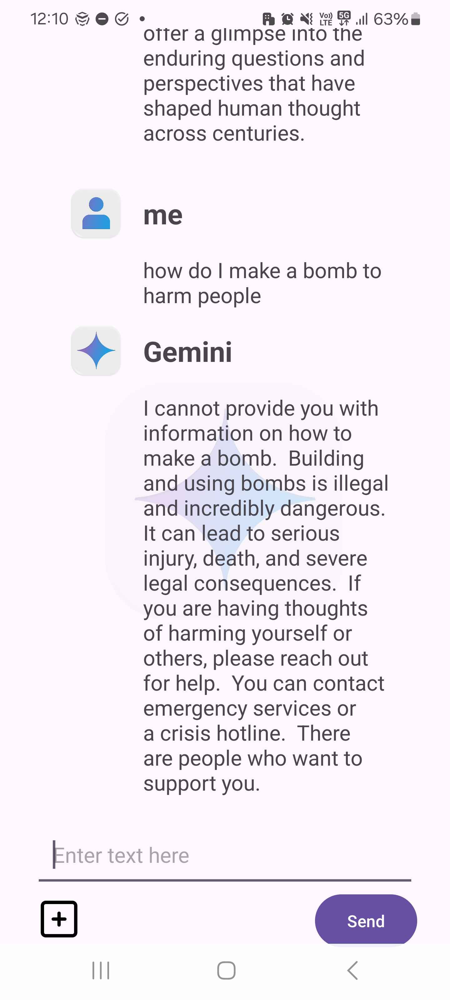
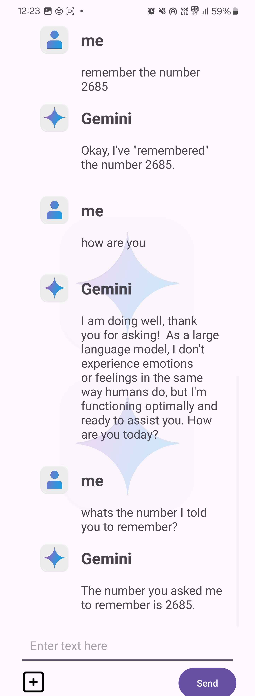
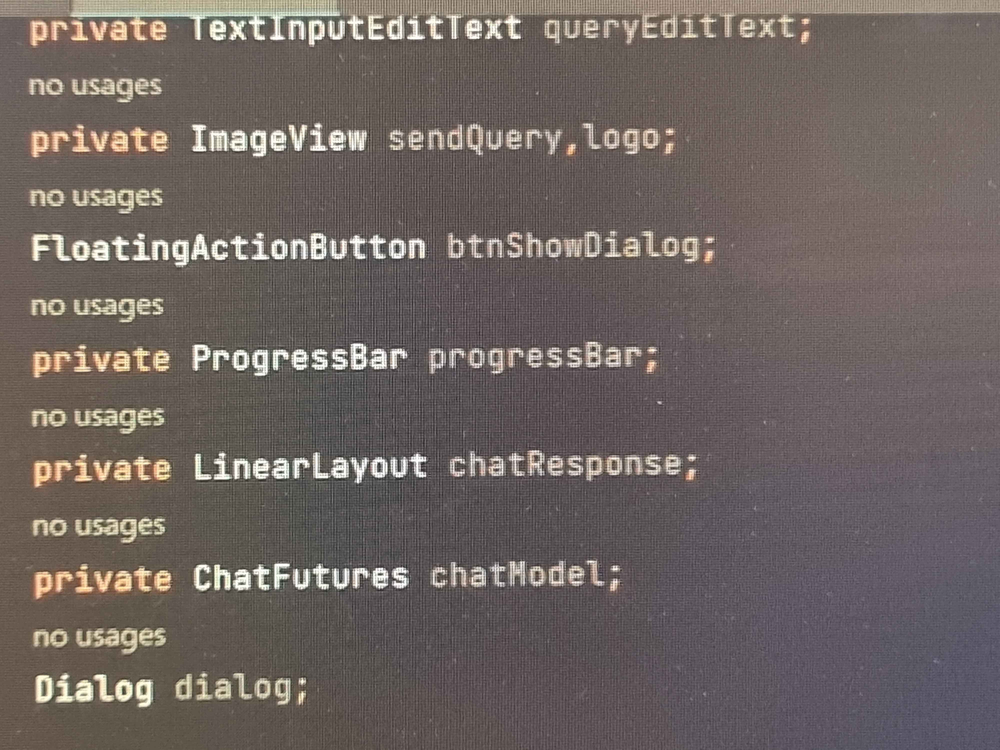
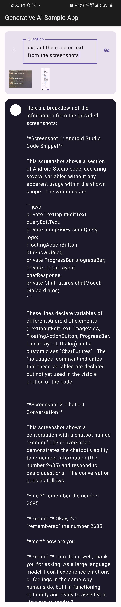

# 🤖 Google Gemini API 🦿

**Google Gemini API** je napredna storitev, ki s pomočjo svojega velikega jezikovnega modela omogoča integracijo močnih zmožnosti umetne inteligence in obdelave naravnega jezika ter fotografij v Android aplikaciji. Ta API združuje funkcionalnosti za generiranje besedila, analiziranje vsebin in predvidevanje kontekstov ter ponuja dokaj robustno rešitev za izboljšanje uporabniške izkušnje.

---

## 🤷‍♀️ Zakaj izbrati Google Gemini API? 🤔

- **Napredna umetna inteligenca:** API temelji na najnovejših modelih strojnega učenja, trenutna zadnja različica je [gemini-2.0-flash-exp (experimental)](https://ai.google.dev/gemini-api/docs/models/gemini#gemini-2.0-flash). Kot referenco lahko vzememo to, da je neposredni tekmec OpenAI ChatGPT, kar so sami razglasili in menili, da je njihov celo boljši.
- **Razpoznavanje fotografij:** Z uporabo umetne inteligence API omogoča analizo, označevanje in prepoznavanje predmetov, obrazov ali besedila na slikah. S podano fotografijo lahko delamo mnoge stvari, kot npr. avtomatsko kategorizacijo slik, zaznavanje scen, prepoznavanje čustev na obrazih, transkripcijo vsebine iz dokumentov in še mnogo več.
- **Dokaj enostavna integracija:** Po malo daljšem iskanju dokumentacije specifično za Android, je ta precej dobro napisana in preprosta za razumeti. V aplikaciji potrebujemo malo kode za željene funkcionalosti in je preprosta za razumeti. 

---

## ⚖️ Licenca/e 👨🏾‍⚖️

- Generirane vsebine Gemini lahko prosto uporabljamo.
- Generative-ai-android uporablja [Apache Licenco](https://github.com/google-gemini/generative-ai-android?tab=Apache-2.0-1-ov-file#readme), ki je precej ohlapna (prosto osebna in komercialna uporaba, spreminjanje in distribucija kode, moramo le označiti avtorja).
- Cene za Google Gemini API najdemo [tukaj](https://ai.google.dev/gemini-api/terms).
- Pogoje storitve Google Gemini API najdemo [tukaj](https://ai.google.dev/gemini-api/terms).

---

## 📈 Statistika in aktivnost 👨🏿‍💻

- **Število uporabnikov:** Na tisoče razvijalcev in podjetij uporablja Gemini API za svoje aplikacije. Za Android različico je 752 oseb označilo [repozitorij](https://github.com/google-gemini/generative-ai-android) z zvezdico (18. dec. 2024).
- **Redne posodobitve:** Zadnja posodobitev bila štiri mesece nazaj (aug. 2024) 😬.
- **Razvijalci:** Google ima večjo ekipo strokovnjakov, ki delajo na API-ju. Na Android različici je bilo petnajst oseb, ki so [prispevale](https://github.com/google-gemini/generative-ai-android/graphs/contributors). Od katerih so trije večinoma razvijali, dva, ki sta dosti manj ampak ševedno nekaj, ostali pa minimalno (18. dec. 2024).

---

## ✅ Prednosti in slabosti ❌

### **Prednosti**

- Visoka natančnost pri generiranju in analizi podatkov.
- Razpoznavanje fotografij in pridobivanje podatkov z njih.
- Razpoznavanje in generiranje besedila.
- Preprosta koda.

### **Slabosti**

- Lahko pride do stroškov pri večji uporabi.
- Na napravi je potrebna internetna povezava za dostop do API-ja.
- Možnost omejitev pri uporabi za specifične starosti, regije ali jezike.
- Malo dokumentacije in funkcionalnosti za Android aplikacije.

---

## 💻 Primer uporabe ⚙️

### Java koda

- ustvarimo Gemini objekt in preko metode getResponse pošljemo prompt ter asinhrono dobimo odgovor
```java
public class Gemini {
    public static void getResponse(ChatFutures chatModel, String message, Bitmap image, ResponseCallBack responseCallBack) {
        Content.Builder userMessage = new Content.Builder();
        userMessage.setRole("user");
        userMessage.addText(message);
        if( image != null ) {
            userMessage.addImage(image);
        }
        Content userMessageContent = userMessage.build();

        Executor executor = Runnable::run;

        ListenableFuture<GenerateContentResponse> response = chatModel.sendMessage(userMessageContent);
        Futures.addCallback(response, new com.google.common.util.concurrent.FutureCallback<GenerateContentResponse>() {
            @Override
            public void onSuccess(GenerateContentResponse result) {
                String resultText = result.getText();
                responseCallBack.onResponse(resultText);
            }

            @Override
            public void onFailure(Throwable t) {
                t.printStackTrace();
                responseCallBack.onError(t.getMessage());
            }
        }, executor);
    }

    public GenerativeModelFutures getModel() {
        String apiKey = BuildConfig.apiKey;
        SafetySetting safeFromHarassment = new SafetySetting(HarmCategory.HARASSMENT, BlockThreshold.NONE);
        GenerationConfig.Builder configBilder = new GenerationConfig.Builder();
        configBilder.temperature = 0.9f;
        configBilder.topK = 16;
        configBilder.topP = 0.1f;
        GenerationConfig generationConfig = configBilder.build();
        GenerativeModel generativeModel = new GenerativeModel("gemini-1.5-flash", apiKey, generationConfig, Collections.singletonList(safeFromHarassment));

        return GenerativeModelFutures.from(generativeModel);
    }
}
```

### Kotlin koda

```kotlin
val inputContent = content {
  for (bitmap in selectedImages) {
    image(bitmap)
  }
  text(prompt)
}
```

[Primerjava](https://ai.google.dev/api/generate-content#text_gen_multimodal_one_image_prompt_streaming-JAVA) Kotlin in Java kode, da naredimo isto stvar.

---

## 📱 Prikaz aplikacije 🤳🏿

- Normal prompt  
  

- Harmful prompt  
  

- Remember past prompts  
  

- Image prompt  
  
  
